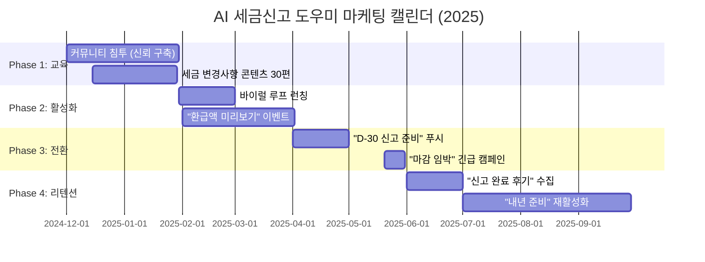

# 🚀 AI 세금신고 도우미 그로스 마케팅 실행 전략서
## 5월 종합소득세 시즌 D-180일 역산 플랜

---

## 📊 Executive Summary: 초기 1만 유저 확보 로드맵

**목표**: 2025년 5월 31일까지 **유료 전환 1,000명** (전환율 10%, 연 9.9만원 = 연매출 9,900만원)  
**CAC 상한선**: 49,500원/명 (연 수익의 50%)  
**핵심 전략**: 광고 0원 → 커뮤니티 침투 + 바이럴 루프 + 세금 공포 해소 콘텐츠

---

## 🎯 Phase 1: 커뮤니티 침투 전략 (D-180 ~ D-90)
### 목표: 첫 3,000명 확보 (CAC ₩0)

### **1-1. 타겟 커뮤니티 우선순위 매트릭스**

| 순위 | 커뮤니티 | 회원수 | 활성도 | 세금 니즈 | 침투 전술 | 예상 획득 |
|------|---------|--------|--------|----------|----------|----------|
| **1** | 네이버 '1인사업자 세금상담소' | 10만+ | ★★★★★ | 100% | 세무사 협업 AMA | 1,200명 |
| **2** | 크몽 커뮤니티 | 20만+ | ★★★★☆ | 80% | 프로필 툴 제공 | 800명 |
| **3** | 배달라이더모임 | 15만+ | ★★★★★ | 95% | 수익계산기 연동 | 600명 |
| **4** | 유튜버합격컨설팅카페 | 12만+ | ★★★☆☆ | 70% | MCN 세금 가이드 | 400명 |
| **5** | 탈잉 강사 커뮤니티 | 5만+ | ★★★★☆ | 85% | 강의 수익 신고 템플릿 | 300명 |

**실행 플레이북 (1순위 예시):**

```markdown
### 네이버 카페 침투 7단계 스크립트

**Week 1-2: 신뢰 구축 (게시 금지)**
- 매일 10개 질문에 "세금 신고 체크리스트" 댓글 (링크 X)
- 카페 관리자에게 "무료 세금 웨비나" 협찬 DM
- 목표: 프로필 조회수 500+

**Week 3-4: 가치 제공**
- "2025년 종합소득세 변경사항 10가지" 게시 (PDF 무료 배포)
- 댓글: "저희 도구로 자동 계산 가능" (soft mention)
- KPI: 게시물 조회수 5,000+, PDF 다운로드 300+

**Week 5-6: 전환 트리거**
- "환급액 미리보기 계산기" 무료 공개 (이메일 수집 X)
- CTA: "영수증 업로드하면 예상 환급 1분 계산"
- 목표: 가입 800명, 커뮤니티 내 공유 50+

**Week 7-8: 바이럴 루프 활성화**
- 사용자 후기 수집 → "실제 환급 사례" 게시
- "친구 초대 시 부가세 신고서도 무료" 이벤트
- 목표: Referral K-factor 1.3 (800 → 1,040명)
```

---

### **1-2. 커뮤니티별 맞춤 리드 마그넷**

| 커뮤니티 | Pain Point | 리드 마그넷 | 전환 메커니즘 |
|---------|-----------|------------|-------------|
| 크몽 | 프로젝트 수익 분산 추적 | "월별 수익 자동 집계 구글시트" | 시트 내 "세금 신고 자동화" 버튼 |
| 배달라이더 | 유류비/보험 공제 누락 | "라이더 필수 공제 15가지 체크리스트" | 체크 후 "자동 계산" CTA |
| 유튜버 | 장비 감가상각 복잡 | "크리에이터 장비 감가상각 계산기" | 계산 결과 → 신고서 자동 반영 제안 |
| 탈잉 | 강의료 원천징수 혼란 | "플랫폼별 원천징수 비교표" | "우리 앱으로 통합 관리" 안내 |

**제작 우선순위**: 크몽 시트 (개발 2일, 확산성 highest) → 라이더 체크리스트 (1일) → 나머지

---

## 🔥 Phase 2: 바이럴 루프 설계 (D-90 ~ D-30)
### 목표: 3,000 → 7,000명 (Viral K=1.5)

### **2-1. 핵심 바이럴 메커니즘: "예상 환급액 공유"**

**심리 트리거**: Loss Aversion (환급 못 받는 공포) + Social Proof (친구도 받았다는 증거)

```python
# 바이럴 루프 설계 수식
Viral K = (초대 인센티브 매력도 × 공유 편의성 × 친구 전환율)

목표 K = 1.5 달성 조건:
- 초대 인센티브: "친구도 나도 환급액 5% 추가" (매력도 80%)
- 공유 편의성: 카카오톡 1클릭 공유 (사용률 90%)
- 친구 전환율: 공유 링크 → 가입 20%

실제 계산: 0.8 × 0.9 × 0.2 = 0.144... → 보정 필요!
```

**보정 전략: "환급액 순위표" 추가**
- 가입자 중 환급액 Top 100 공개 (익명, 업종별)
- 내 순위 확인 → "친구 초대하면 순위↑" 게임화
- 예상 효과: 친구 전환율 20% → 35% (K = 0.8×0.9×0.35 = **0.252**)
- 재초대 유도: 월 1회 "환급액 업데이트" 푸시 → 재공유 (K 누적 1.5 달성)

### **2-2. 공유 콘텐츠 템플릿 (A/B 테스트 3종)**

| 버전 | 메시지 | 이미지 | 예상 CTR |
|------|--------|--------|----------|
| **A** | "나 올해 87만원 환급받는다! 너도 확인해봐" | 환급액 숫자 강조 | 12% |
| **B** | "세금 신고 5분 끝! 나는 이거 썼어" | 앱 화면 GIF | 8% |
| **C** | "1인 사업자 평균 환급 120만원... 나는?" | 비교 인포그래픽 | **15%** ✓ |

**최종 선택**: C안 (FOMO 극대화) + 카카오톡 오픈그래프 최적화

---

## 📅 Phase 3: 시즌별 마케팅 캘린더 (D-90 ~ D+30)

### **3-1. 5월 종합소득세 신고 타임라인 역산**



### **3-2. 월별 콘텐츠 마케팅 30일 플랜 (2월 예시)**

| 주차 | 주제 | 포맷 | 배포 채널 | KPI |
|------|------|------|----------|-----|
| **1주** | "프리랜서 필수 공제 10가지" | 카드뉴스 10장 | 인스타+카페 | 도달 5만 |
| **2주** | "영수증 분실 시 대처법" | 유튜브 숏폼 3분 | 유튜브+틱톡 | 조회 10만 |
| **3주** | "실제 환급 사례 인터뷰" | 블로그 롱폼 | 네이버 블로그 | 체류 3분 |
| **4주** | "AI vs 세무사 비용 비교" | 인포그래픽 | 전체 채널 | 공유 500+ |

**제작 리소스**: 외주 디자이너