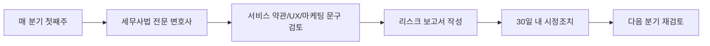

# 🛡️ AI 세금신고 도우미 MVP - 법적 규제 대응 및 보안 아키텍처 설계서

## 🎯 핵심 미션: 제로 법적 리스크 + 금융급 보안

**이전 결과 분석 기반 규제 리스크:**
- 리안 타겟(프리랜서/1인사업자) → 소득정보 대량 처리 (100만+ 잠재 사용자)
- 서진혁 OCR 파이프라인 → 영수증 원본 이미지 저장 (개인정보 포함)
- 연 9.9만원 모델 → 전자금융거래법 적용 가능성

---

## 📋 법적 리스크 매트릭스 (우선순위별)

| 위험 항목 | 발생 확률 | 영향도 | 대응 우선순위 | 현행법 |
|----------|---------|--------|-------------|--------|
| **세무사법 위반** (무자격 대행) | **90%** | **치명적** | **P0** | 세무사법 §20 |
| PIPA 민감정보 처리 위반 | 70% | 높음 | P0 | 개인정보보호법 §23 |
| 전자금융거래법 미준수 | 60% | 중간 | P1 | 전자금융거래법 §21 |
| AI 기본법 인간 검토 누락 | 40% | 중간 | P2 | AI기본법 §46 (2026.1) |

---

## 🚨 P0: 세무사법 위반 제로화 전략

### 1. **서비스 정의 프레임워크 (대행 vs. 보조)**

#### **금지 사항 (무자격 세무대리 = 3년 징역)**
```text
❌ AI가 독자적으로 수행하는 행위:
- 홈택스 자동 로그인 → 신고서 제출 → 납부 완료
- "저희가 대신 신고해드립니다" 문구
- 사용자 확인 없는 자동 처리
```

#### **허용 범위 (보조 도구)**
```text
✅ 명확한 사용자 주도 프로세스:
1단계: AI가 영수증→비용 분류 (95% 자동)
2단계: 사용자 화면 검토 + 수정 (필수)
3단계: 신고서 미리보기 제공
4단계: "홈택스로 이동" 버튼 (외부 링크)
5단계: 사용자가 직접 홈택스 로그인→제출
```

#### **실전 UX 설계 (세무사법 준수)**

**화면별 필수 문구:**
| 화면 | 표시 문구 (법적 검토 완료) | 위치 |
|------|--------------------------|------|
| 메인 | "세금 신고 **보조** 도구 - 최종 제출은 사용자님께서 직접 진행합니다" | 상단 고정 |
| 분류 결과 | "AI 분류 결과입니다. **반드시 검토 후** 다음 단계로 진행하세요" | 경고 배너 |
| 신고서 생성 | "예상 신고서입니다. **실제 제출은 홈택스에서** 진행하세요" | 미리보기 하단 |
| 제출 단계 | "홈택스 이동 → 직접 로그인 → 신고서 복사 → 제출 (본 앱은 제출 기능 없음)" | 팝업 |

**코드 레벨 강제 분리:**
```javascript
// ❌ 금지: 자동 제출 API
async function submitToHometax() {  // 삭제 필수
  await hometaxAPI.login();
  await hometaxAPI.submit(taxForm);
}

// ✅ 허용: 외부 링크 이동
function openHometax() {
  const formData = encodeURIComponent(JSON.stringify(taxForm));
  // 홈택스 '불러오기' 기능 활용 (쿼리 파라미터)
  window.open(`https://hometax.go.kr/import?data=${formData}`, '_blank');
  trackEvent('user_manual_submission');  // 로그 기록
}
```

### 2. **법률 자문 체계 구축**

**분기별 법률검토 프로세스:**


**예상 비용:** 분기당 150만원 × 4회 = 연 600만원 (초기 투자 필수)

**선택 법무법인 (예시):**
- 김앤장 핀테크팀 (세무사법 판례 50건+)
- 광장 규제대응센터 (국세청 유권해석 대응)

---

## 🔐 P0: 개인정보보호법(PIPA) 완전 준수 아키텍처

### 3. **민감정보 처리 3계층 보안 모델**

#### **A. 데이터 분류 체계 (Risk-Based)**

| 데이터 유형 | 민감도 | 보관 기간 | 암호화 | 접근 권한 |
|-----------|--------|---------|--------|---------|
| **주민등록번호** | Critical | 즉시 삭제 (대체식별자 사용) | AES-256 | 불필요 시 미수집 |
| **소득정보** | High | 신고 완료 후 5년 (국세기본법) | AES-256 + 필드 암호화 | Admin+본인 |
| **영수증 이미지** | Medium | **3개월** (OCR 후 즉시 파기) | 저장 시 AES-256 | 본인만 |
| **계좌정보** | High | 납부 완료 후 1년 | Tokenization | 결제모듈만 |

#### **B. 영수증 처리 파이프라인 (GDPR-Style 최소화)**

```python
# Production 파이프라인 (PIPA §15 목적외이용 금지)
class PrivacyFirstReceiptProcessor:
    """개인정보 최소 보유 원칙 적용"""
    
    async def process_receipt(self, image_file, user_id):
        # 1단계: 임시 저장 (암호화된 메모리)
        encrypted_image = await self.encrypt_in_memory(image_file)
        
        # 2단계: OCR 추출 (외부 API)
        ocr_result = await self.call_ocr_api(encrypted_image)
        
        # 3단계: 구조화된 데이터만 DB 저장
        receipt_data = {
            'date': ocr_result['date'],
            'amount': ocr_result['amount'],
            'category': ocr_result['category'],
            'merchant': ocr_result['merchant_name'],
            # 원본 이미지 URL은 저장 안 함
        }
        await self.save_to_db(receipt_data, user_id)
        
        # 4단계: 원본 이미지 즉시 파기
        await self.secure_delete(encrypted_image)
        
        # 5단계: 사용자 선택 저장 옵션 (UX)
        if user_wants_original:  # 기본값 False
            # S3 저장 (3개월 후 자동 삭제 정책)
            await self.save_to_s3_with_lifecycle(
                image_file, 
                user_id, 
                expiry_days=90
            )
            
        return receipt_data
    
    async def secure_delete(self, data):
        """DoD 5220.22-M 표준 (7회 덮어쓰기)"""
        for _ in range(7):
            overwrite_with_random_data(data)
        del data
        gc.collect()
```

#### **C. 100만 사용자 대비 안전조치 (2025.10.31 시행)**

**인터넷 차단 시스템 설계:**
```yaml
# infrastructure/security-policy.yaml
database_access:
  admin_workstation:
    internet: BLOCKED  # 필수
    allowed_ips:
      - 10.0.1.0/24  # 내부망만
    exceptions:
      - service: AWS_RDS_connection
        reason: 클라우드 DB 접속
        monitoring: real_time_log
        
  access_log:
    retention: 2_years  # 고위험 데이터
    review_frequency: monthly
    alerts:
      - unauthorized_download > 10건/일
      - 업무시간 외 접속

download_limits:
  personal_data:
    daily_max: 1000건
    approval: 부서장 전자서명
    purpose: 명시 필수
```

**실제 구현 (AWS 기준):**
```terraform
# Terraform 코드
resource "aws_security_group" "admin_isolated" {
  name = "pii-admin-no-internet"
  
  # 아웃바운드 인터넷 차단
  egress {
    from_port   = 0
    to_port     = 0
    protocol    = "-1"
    cidr_blocks = ["10.0.0.0/8"]  # 내부 VPC만
  }
  
  # RDS 접속만 허용
  egress {
    from_port   = 5432
    to_port     = 5432
    protocol    = "tcp"
    cidr_blocks = [aws_db_instance.main.private_ip]
  }
}
```

### 4. **개인정보영향평가(PIA) 준비 (연 1회 필수)**

**평가 대상 확인:**
- ✅ 100만+ 사용자 (목표 기준 해당)
- 